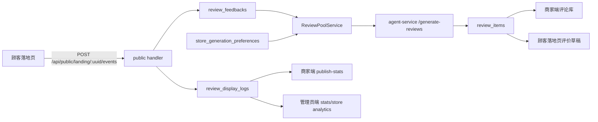

# 数据流转与展示来源图

本文记录商家端、管理员端和顾客落地页展示数据的来源边界，避免把 Mock 数据、客户端埋点数据、平台官方数据混在一起解释。

## 总体结论

- 真实 API 模式下，商家端、管理员端、顾客落地页共用同一个 Go 后端和同一个 MySQL 数据库连接。
- 管理员端和商家端统计都来自 `review_display_logs` 等真实数据库表，不各自维护第二套业务数据。
- `frontend/src/api/mock.ts` 只允许在 `VITE_USE_MOCK=true` 时动态加载；生产默认 API bundle 不应携带 Mock 演示数据。
- NFC 访问、平台点击、设备占比属于客户端落地页事件日志，不等同于第三方平台官方成交或评价数据。

## 核心链路

## 商家端展示数据

| 展示区域 | API | 主要来源 |
| --- | --- | --- |
| 门店资料、关键词、图片、平台链接 | `/api/merchant/store/*` | `stores`, `store_keywords`, `store_images`, `store_platform_links` |
| 评论库 | `/api/merchant/store/reviews` | `review_items` |
| 发布/访问/设备统计 | `/api/merchant/dashboard/publish-stats` | `review_display_logs` |
| 生成方向 | `/api/merchant/review-generation-preferences` | `store_generation_preferences` |
| 生成任务 | `/api/merchant/review-generation-tasks` | `review_generation_tasks` |

## 管理员端展示数据

| 展示区域 | API | 主要来源 |
| --- | --- | --- |
| 商家/门店总览 | `/api/admin/stats` | `merchant_users`, `stores`, `nfc_tags`, `review_generation_tasks`, `store_review_crawl_configs` |
| 全局访问/点击/设备统计 | `/api/admin/stats` | `review_display_logs` |
| 门店列表与门店分析 | `/api/admin/stores` | `stores`, `merchant_users`, `store_platform_links`, `review_display_logs`, `store_review_crawl_configs` |
| 评论采集批次和匹配明细 | `/api/admin/stores/:id/review-crawl/*` | `store_review_crawl_batches`, `external_store_reviews`, `review_feedbacks`, `review_items` |
| NFC 标签 | `/api/admin/nfc-tags` | `nfc_tags` |
| 生成任务 | `/api/admin/review-generation-tasks` | `review_generation_tasks`, `review_generation_audit_logs` |

## 生成失败审计

- Go 后端每次创建 `review_generation_tasks` 后，会把关键阶段写入 `review_generation_audit_logs`。
- 关键阶段包括 `task_started`, `agent_request`, `agent_response`, `agent_error`, `duplicate_filter`, `pool_empty`, `db_insert_error`, `task_completed`。
- `agent_error` 会记录 agent-service 地址、HTTP 状态码、耗时和错误消息；如果 FastAPI 返回了 `detail`，Go 侧会把响应体带入 `error_message` 和审计日志。
- Go 进程日志会输出 `review_generation_audit ...`，Python agent-service 会输出 `agent_generation_start/success/runtime_error/bad_request/unhandled_error`，两边通过 `X-Generation-Task-ID` 对齐。
- 本地端口服务失败时，先看管理端“生成任务”的失败原因和最近日志；再用同一个 task id 去查 Go 后端日志和 agent-service stdout。

## Mock 边界

- 开发命令 `npm run dev:mock` 会通过 `VITE_USE_MOCK=true` 启用 `frontend/src/api/mock.ts`。
- 生产构建默认不启用 Mock，`frontend/src/api/http.ts` 只在 Mock 模式动态 import Mock adapter。
- Mock 返回的来源标识为 `mock_review_display_logs`，真实 API 返回的来源标识为 `review_display_logs`。
